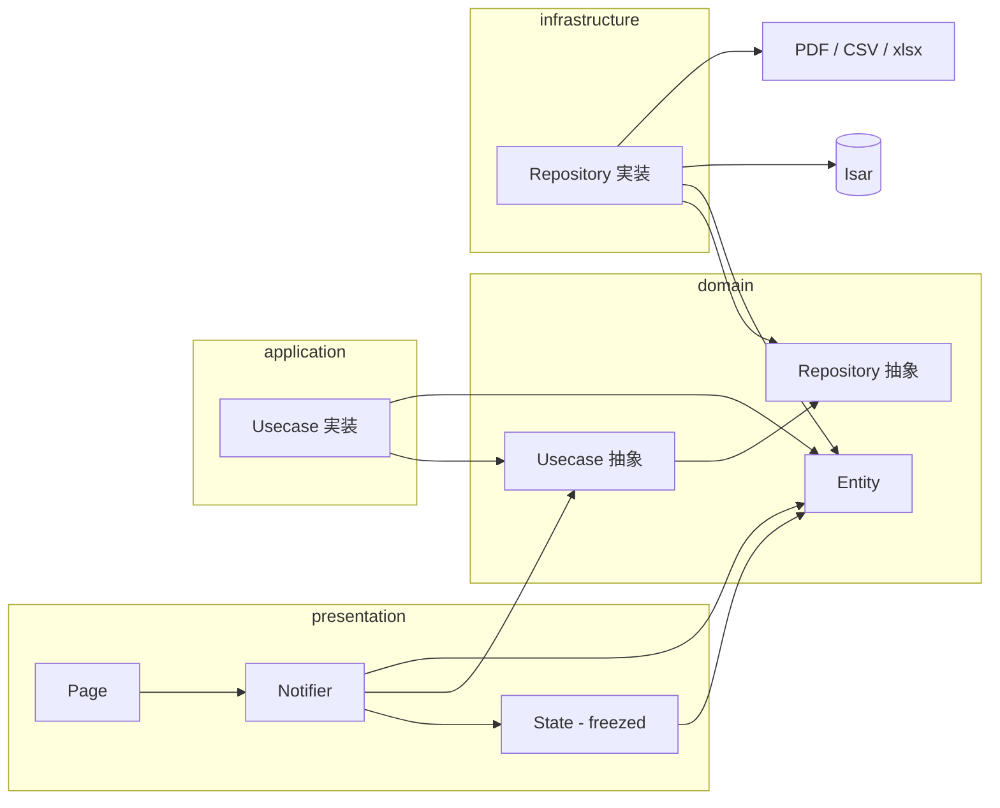

# 猪狩り勤怠管理アプリ — Wild Boar

設計・実装・ストア申請までを個人で行い、**iOS / Android 両方でリリース済み**のアプリです。  
猟友会の方へのヒアリングをもとに、紙やメモに頼らず**現場で記録・確認・帳票出力**までを完結できることを目指しました。

<p align="center">
  
</p>

<p align="center">
  <a href="https://apps.apple.com/jp/app/wild-boar/id6756534353"></a>
  &nbsp;
  <a href="https://play.google.com/store/apps/details?id=com.gmail.tsbs11152.boar_time&amp;hl=ja"></a>
</p>

> 本リポジトリ `boar_time` は上記ストア掲載名 **Wild Boar** と同一アプリのソースコードです。

## 主な機能

- **打刻** — 出勤・退勤・休憩をワンタップで記録
- **解体** — 解体作業の時間管理、月次の累計表示
- **見回り** — 同一日内の複数回記録に対応。業務内容・従事者名・場所・捕獲獣種/数・備考を記録
- **エクスポート** — 解体・見回りの記録を PDF / CSV / Excel で出力
- **データは端末内のみに保存** — クラウド同期はなし。アプリ削除でデータは失われる旨を初回起動時に案内

## 技術スタック

| 区分 | 採用技術 |
| --- | --- |
| フレームワーク | Flutter 3.x（Dart SDK `^3.8.1`） |
| 状態管理 | `hooks_riverpod`, `flutter_hooks` |
| ローカル DB | `isar_community` |
| コード生成 | `freezed`, `build_runner`, `isar_community_generator` |
| UI | Material 3, `flutter_screenutil`, `flutter_animate` |
| 帳票・ファイル | `pdf`, `excel`, `open_filex`, `path_provider` |
| 設定管理 | `shared_preferences` |

## 技術選定理由

- **Flutter**  
  - iOS / Android を**単一コードベース**で開発・保守できる。

- **Riverpod + flutter_hooks**  
  - **Notifier / AsyncNotifier:** 画面ごとの状態と操作を担当。永続化や帳票出力は **Usecase → Repository（抽象）** に任せ、具体実装は **DI** で注入するクリーンアーキテクチャ寄りの構成にした。
  - **Provider:** NotifierやRepository/Usecaseの具象を`lib/di`で束ねて、Viewからは抽象にだけ依存しやすくしている。
  - **Hooks（`flutter_hooks`）:**
    - `useState`: ダイアログ内の選択値など、画面ローカルな一時状態を簡潔に管理。Riverpodで扱うほどではない状態に使用。
    - `useEffect`: アプリのライフサイクル復帰時にデータを再取得するなど、副作用の実行タイミングを制御。

- **Isar（isar_community）**  
  - オンデバイス永続化に特化している。
  - クラウド同期を前提としない本アプリに合う。

- **freezed + build_runner**  
  - Stateモデルとして使用。`copyWith`で別オブジェクトを生成するため、NotifierのStateに使うことで状態更新を適切に検知できる。

- **flutter_screenutil**  
  - 基準解像度に対する比率でサイズを算出し、端末ごとの画面サイズ差によるレイアウト崩れを抑える。

- **pdf / excel / open_filex**  
  - 現場・事務側への提出用フォーマットをアプリ内で生成する必要があるため。
  - CSVは他システム取り込み用に作成。

- **shared_preferences**  
  - 初回起動の案内表示フラグなど、キー・バリュー程度の設定に限定して使用。

## アーキテクチャ

クリーンアーキテクチャに近い層の分離を採用しています。

- **ドメイン層** — フレームワークに依存しない Entity・抽象（Repository / Usecase）・共有 enum（`domain/enums/`）
- **アプリケーション層** — ユースケースの組み立て（`lib/application`）
- **インフラ層** — Isar・ファイル出力などの具体技術（`lib/infrastructure`）
- **プレゼンテーション層** — 画面と Notifier。Usecaseは抽象経由で利用
- **依存の注入** — 具象の組み立ては `lib/di`のProviderに集約

### レイヤ間の依存



矢印は「依存の向き（利用する側 → される側）」を表します。**domainは他の層に依存しません**。`lib/di` は各層の具象を束ねて注入する役割です。

| ディレクトリ | 責務 |
| --- | --- |
| `lib/presentation/` | 画面・共通ウィジェット、`HookConsumerWidget` 等。RiverpodのNotifier、画面用State（freezed）、`auto_route`によるルーティング |
| `lib/application/` | ドメインのユースケースインターフェースの実装。複数Repositoryを組み合わせたアプリ固有の手続き |
| `lib/domain/` | Entity、Repository / Usecaseの抽象、全体で共有する列挙（`enums/`：例 `ExportFormat`、`JobType`、`PatrolLabel`） |
| `lib/infrastructure/` | Repository実装、Isarの`@collection`スキーマ（`isar/`）、Datasource、永続化用Model・Factory、帳票用ExportDatasource（PDF / CSV / Excel） |
| `lib/di/` | Providerによる具象の生成・注入（IsarとSharedPreferencesは`main`で初期化し、`overrideWithValue`で渡す） |
| `lib/utils/migration/` | バージョンアップに伴うデータ移行 |

**依存の向き（原則）:** 内側の`domain`は外側を知らない。

**起動フロー:** `main`でIsar初期化 → マイグレーション → SharedPreferences取得 → ProviderScopeの`overrides`で`isarProvider` / `sharedPreferencesProvider` を注入 → `runApp`（`lib/main.dart`）。

## セットアップ

**前提:** Flutter SDK（動作確認は Flutter 3.38 系）、Xcode（iOS）、Android Studio（Android）

```bash
flutter pub get
dart run build_runner build --delete-conflicting-outputs
flutter run
```

リポジトリ直下の `build_runner.sh` でもコード生成を実行できます。

| 項目 | 値 |
| --- | --- |
| Android `minSdk` | 21 |
| iOS 最低バージョン | 13.0 |

`android/key.properties` および keystore はローカル秘密情報のためリポジトリには含めていません。

## ライセンス

[MIT License](LICENSE)

## 今後の改善案

- 自動テストの拡充（ユニット / ウィジェット）
- CIによる`analyze`とビルドの自動化
- ユーザーからのフィードバックを反映した機能改善
