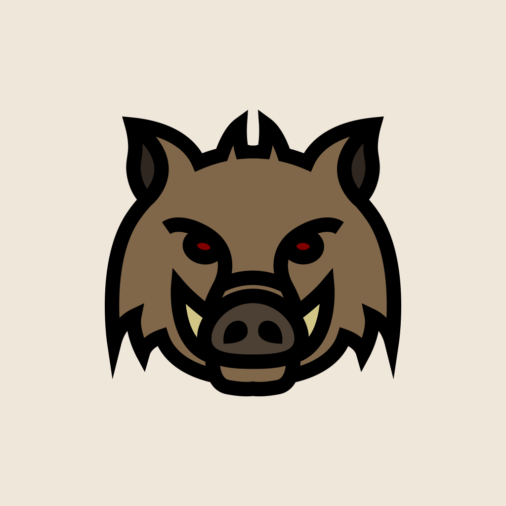
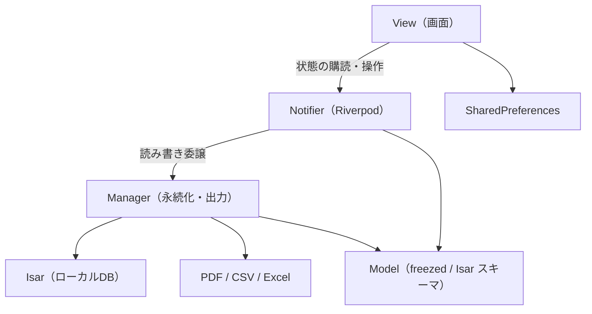

# 猪狩り勤怠管理アプリ — Wild Boar

設計・実装・ストア申請までを個人で行い、**iOS / Android 両方でリリース済み**のアプリです。  
猟友会の方へのヒアリングをもとに、紙やメモに頼らず**現場で記録・確認・帳票出力**までを完結できることを目指しました。

<p align="center">
  
</p>

<p align="center">
  <a href="https://apps.apple.com/jp/app/wild-boar/id6756534353"></a>
  &nbsp;
  <a href="https://play.google.com/store/apps/details?id=com.gmail.tsbs11152.boar_time&amp;hl=ja"></a>
</p>

> 本リポジトリ `boar_time` は上記ストア掲載名 **Wild Boar** と同一アプリのソースコードです。

## 主な機能

- **打刻** — 出勤・退勤・休憩をワンタップで記録
- **解体** — 解体作業の時間管理、月次の累計表示
- **見回り** — 同一日内の複数回記録に対応。業務内容・従事者名・場所・捕獲獣種/数・備考を記録
- **エクスポート** — 解体・見回りの記録を PDF / CSV / Excel で出力
- **データは端末内のみに保存** — クラウド同期はなし。アプリ削除でデータは失われる旨を初回起動時に案内

## 技術スタック

| 区分 | 採用技術 |
| --- | --- |
| フレームワーク | Flutter 3.x（Dart SDK `^3.8.1`） |
| 状態管理 | `hooks_riverpod`, `flutter_hooks` |
| ローカル DB | `isar_community` |
| コード生成 | `freezed`, `build_runner`, `isar_community_generator` |
| UI | Material 3, `flutter_screenutil`, `flutter_animate` |
| 帳票・ファイル | `pdf`, `excel`, `open_filex`, `path_provider` |
| 設定管理 | `shared_preferences` |

## 技術選定理由

- **Flutter**  
  - iOS / Android を**単一コードベース**で開発・保守できる。

- **Riverpod + flutter_hooks**  
  - **Notifier / AsyncNotifier:** 画面ごとのビジネスロジックと状態保持を担当。Manager層へ永続化を委譲し、Viewとロジックを分離することで変更の影響範囲を限定しやすい構成にした。
  - **Provider:** NotifierをViewに公開する仕組み。どの画面がどの状態に依存しているかが宣言から一目で分かる。
  - **Hooks（`flutter_hooks`）:**
    - `useState`: ダイアログ内の選択値など、画面ローカルな一時状態を簡潔に管理。Riverpodで扱うほどではない状態に使用。
    - `useEffect`: アプリのライフサイクル復帰時にデータを再取得するなど、副作用の実行タイミングを制御。

- **Isar（isar_community）**  
  - オンデバイス永続化に特化している。
  - クラウド同期を前提としない本アプリに合う。

- **freezed + build_runner**  
  - Stateモデルとして使用。`copyWith`で別オブジェクトを生成するため、NotifierのStateに使うことで状態更新を適切に検知できる。

- **flutter_screenutil**  
  - 基準解像度に対する比率でサイズを算出し、端末ごとの画面サイズ差によるレイアウト崩れを抑える。

- **pdf / excel / open_filex**  
  - 現場・事務側への提出用フォーマットをアプリ内で生成する必要があるため。
  - CSVは他システム取り込み用に作成。

- **shared_preferences**  
  - 初回起動の案内表示フラグなど、キー・バリュー程度の設定に限定して使用。

## アーキテクチャ



| ディレクトリ | 責務 |
| --- | --- |
| `lib/view/` | 画面・ウィジェット。`HookConsumerWidget`等でNotifierを購読 |
| `lib/notifier/` | Riverpodにて、`Notifier` / `AsyncNotifier`をViewに提供。画面用の状態保持とManagerへの委譲 |
| `lib/manager/` | Isar読み書き、エクスポート処理など永続化・出力ロジック |
| `lib/model/` | ドメインモデル・画面用 state（freezed / Isarスキーマ） |
| `lib/utils/migration/` | バージョンアップに伴うデータ移行 |

**起動フロー:** `main`でIsar初期化 → マイグレーション → `ProviderScope`付き`runApp`（`lib/main.dart`）。

## セットアップ

**前提:** Flutter SDK（動作確認は Flutter 3.38 系）、Xcode（iOS）、Android Studio（Android）

```bash
flutter pub get
dart run build_runner build --delete-conflicting-outputs
flutter run
```

リポジトリ直下の `build_runner.sh` でもコード生成を実行できます。

| 項目 | 値 |
| --- | --- |
| Android `minSdk` | 21 |
| iOS 最低バージョン | 13.0 |

`android/key.properties` および keystore はローカル秘密情報のためリポジトリには含めていません。

## ライセンス

[MIT License](LICENSE)

## 今後の改善例

- 自動テストの拡充（ユニット / ウィジェット）
- CIによる`analyze`とビルドの自動化
- ユーザーからのフィードバックを反映した機能改善
